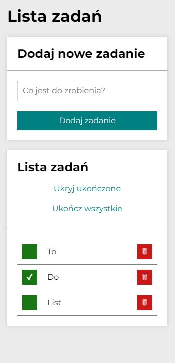

# TO-DO LIST
## DEMO LINK 
https://damianmichalowski.github.io/To-do-list/
## DESCRIPTION
My first app used JS with HTML and CSS. This app allows adding/removing/marking daily tasks on your to-do list. To-do list is a responsive app you can use on whatever you want.
## Technology used
1. Javascript
2. Javascript ES6+ Features (Arrow Functions)
3. HTML
4. CSS
5. CSS (Grid/Flex)
6. MediaQueries
7. BEM
8. Immutability
## Screenshots
### on desktop

### on phones

